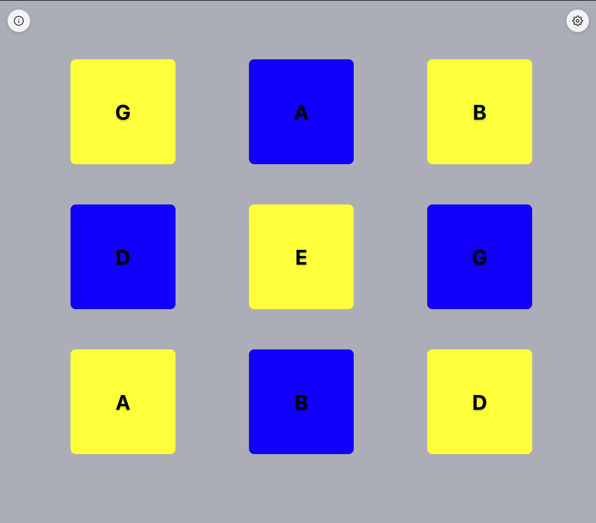
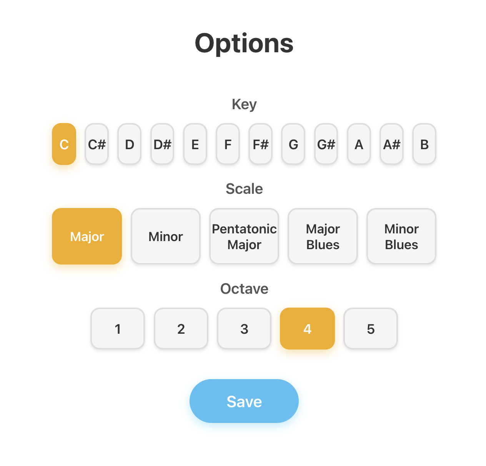
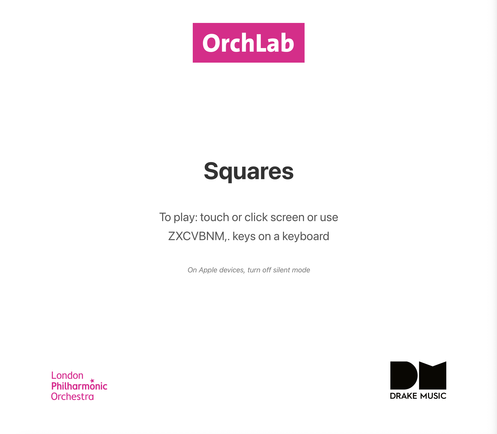
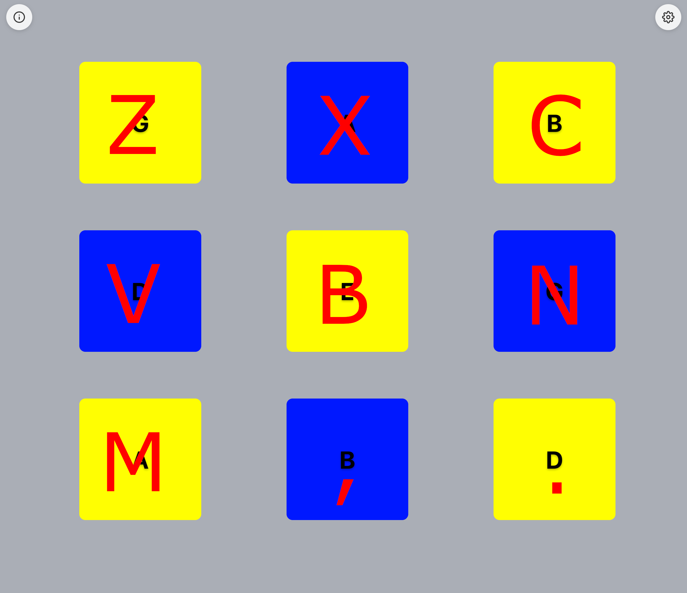
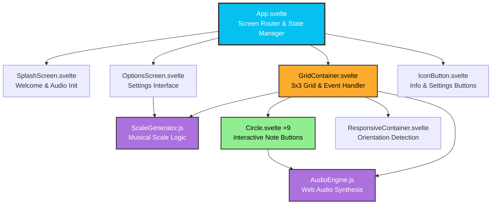

# Circles - Musical Touch Interface

A responsive web-based musical instrument that transforms your screen into a playable 3x3 grid of circles. Each circle plays a note from a configurable musical scale, creating an intuitive and accessible way to make music through touch, mouse, or keyboard.


*The main play interface with 9 interactive circles*

## Features

- **Multi-Scale Support**: Choose from Major, Minor, Pentatonic, Major Blues, and Minor Blues scales
- **12 Keys**: Play in any key from C to B
- **5 Octave Range**: Select octaves 1-5 to match your preferred pitch range
- **Responsive Design**: Adapts seamlessly to portrait and landscape orientations
- **Multiple Input Methods**:
  - Touch/tap on mobile devices
  - Mouse clicks on desktop
  - Keyboard controls (Z, X, C, V, B, N, M, comma, period)
- **iOS 9+ Compatible**: Extensively tested and optimized for older iOS devices
- **Persistent Settings**: Your scale, key, and octave preferences are saved locally


*Configure your musical scale, key, and octave*

## How It Works

The app uses the Web Audio API to generate synthesized sounds in real-time. Each circle in the grid corresponds to a note in your selected scale, arranged from low to high (left to right, top to bottom).

**Audio Engine**: Employs multiple detuned sawtooth oscillators with low-pass filtering to create a rich, warm sound. The envelope includes smooth attack and release phases for natural-sounding notes.

**Scale Generation**: Dynamically generates 9 notes based on your selected key, scale type, and starting octave using chromatic intervals.

## Getting Started


*Welcome screen - tap anywhere to begin*

### Prerequisites

- Node.js (v14 or higher)
- npm or pnpm

### Installation

```bash
# Clone the repository
git clone https://github.com/gawainhewitt/soundmakers_circles.git
cd circles

# Install dependencies
npm install

# Start development server
npm run dev
```

Visit `http://localhost:5173` in your browser.

### Building for Production

```bash
# Build the app
npm run build

# Preview the production build
npm run preview
```

The built files will be in the `dist/` directory, ready for deployment.

### Testing on Mobile Devices

To test the production build on physical mobile devices (especially useful for iOS testing):

```bash
# Build the app first
npm run build

# Serve the production build on your local network
npm run serve
```

The app will be available at your local IP address (e.g., `http://192.168.1.x:3000`). You can access this URL from any device on the same network.

**Note**: This is particularly important for testing iOS-specific features like audio initialization and touch handling, which behave differently in development vs production builds.

## Usage

1. **Launch**: Click/tap anywhere on the splash screen to begin
2. **Play**: 
   - Touch or click the circles to play notes
   - Use keyboard keys (Z-X-C-V-B-N-M-,- .) for the 9 circles
   - Press 'P' key for panic stop (stops all notes)
3. **Configure**: 
   - Tap the settings icon (⚙️) to change key, scale, or octave
   - Tap the info icon (ℹ️) to view instructions again


*Keyboard mapping for the 9 circles*

## iOS Compatibility Notes

This app has been carefully optimized for iOS 9+ devices:

- **Polyfills**: Core-js and regenerator-runtime ensure ES6+ features work on older browsers
- **Audio Unlocking**: Implements iOS-specific audio context initialization
- **Touch Handling**: Advanced touch tracking prevents stuck notes and handles multi-touch scenarios
- **Viewport Management**: Comprehensive fixes for iOS viewport issues when switching apps
- **Zoom Prevention**: Disables pinch-zoom and double-tap-zoom for a native app feel

## Project Structure

```
├── src/
│   ├── App.svelte              # Main app component & screen routing
│   ├── main.js                 # Entry point with iOS fixes
│   ├── app.css                 # Global styles
│   └── lib/
│       ├── AudioEngine.js      # Web Audio API sound generation
│       ├── Circle.svelte       # Individual playable circle
│       ├── GridContainer.svelte # 3x3 grid layout & event handling
│       ├── OptionsScreen.svelte # Settings interface
│       ├── ScaleGenerator.js   # Musical scale generation logic
│       ├── SplashScreen.svelte # Welcome/instructions screen
│       ├── IconButton.svelte   # Reusable icon button component
│       └── ResponsiveContainer.svelte # Orientation handling
├── public/
│   ├── images/                 # Logos and icons
│   └── polyfills/              # iOS 9+ compatibility scripts
└── index.html                  # Entry HTML with polyfill loading
```

## Architecture



*Component hierarchy and data flow*

## Technologies Used

- **Svelte 5**: Modern, reactive UI framework
- **Vite**: Fast build tool and dev server
- **Web Audio API**: Real-time audio synthesis
- **Vite Legacy Plugin**: Automatic transpilation and polyfills for older browsers

### Design Decisions

**Static Site Delivery**: This app is built as a static site (vanilla Vite + Svelte) rather than using SvelteKit. This architectural choice provides:

- **Maximum Compatibility**: Works seamlessly on older devices and browsers (iOS 9+)
- **Lightweight Bundle**: Minimal JavaScript footprint for faster loading on slower devices
- **Simple Deployment**: Can be deployed to any static hosting service without server-side requirements
- **Reduced Complexity**: No SSR overhead or routing complexity for a single-page application

This approach prioritizes accessibility and performance, ensuring the app works reliably across the widest possible range of devices and network conditions.

## Troubleshooting

**No sound on iOS**: Ensure silent mode is turned off. The audio context requires an initial user interaction (handled by the splash screen).

**Stuck notes**: Press the 'P' key to trigger panic stop, or use the window blur detection which automatically stops all notes when switching apps.

**Layout issues after app switching**: The app includes comprehensive viewport reset logic that should handle this automatically.

## Contributing

Contributions are welcome! Please feel free to submit a Pull Request.

## License

See [LICENSE](LICENSE) file for details.

## Credits

Developed in collaboration with:
- [**OrchLab**](https://orchlab.org/)
- [**London Philharmonic Orchestra (LPO)**](https://lpo.org.uk/)
- [**Drake Music**](https://www.drakemusic.org/)
- [**Gawain Hewitt**](https://gawainhewitt.co.uk/)
